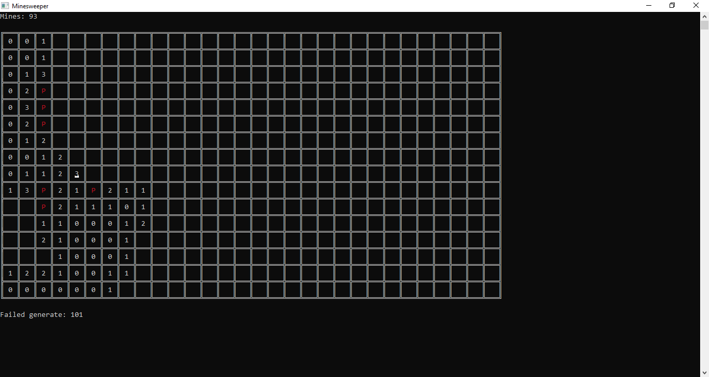

# Minesweeper

Dò mìn là trò chơi giải đố một người chơi đơn giản. Nhiệm vụ dành cho người chơi là tìm chính xác vị trí của tất cả các quả mìn được đặt ngẫu nhiên trên bảng ô vuông.

### Hướng dẫn
- Có 2 loại ô trên bảng:
  - Mìn: kí hiệu là *
  - Số: gồm một trong chín chữ số từ 0 đến 8 hiển thị số lượng ô có mìn xung quanh ô đó.
- Có thể gắn cờ (kí hiệu là F) trên bảng để đánh dấu ô có mìn (chú ý: ô có cờ chưa chắc đã có mìn).
- Nếu mở ô có bom thì trò chơi kết thúc.

### Điều khiển
- A,W,D,S hoặc 4 phím mũi tên để di chuyển.
- Enter/Space để chọn
  - Ô đã mở (Ô hiển thị số): Nếu số cờ xung quanh ô lớn hơn hoặc bằng số trong ô thì mở các ô chưa mở xung quanh.
  - Ô chưa mở: Mở ô.
- F để gắn cờ
  - Ô chưa mở: Gắn cờ cho ô đó.
  - Ô đã được gắn cờ: Bỏ cờ khỏi ô đó.
    
### Một số hình ảnh của trò chơi

